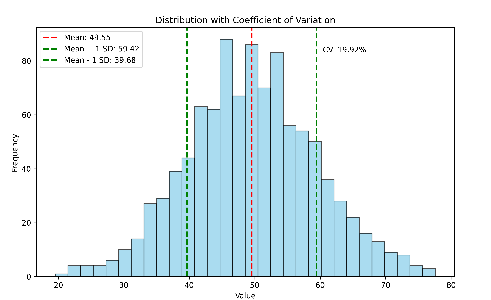

# Coefficient of Variation

### Imagine you have a jar full of candies of different colors. You want to know how much the number of candies of each color varies compared to the average number of candies per color. The Coefficient of Variation helps us understand this variation in a way that is easy to compare, even if we have different types of jars or candies.

### The CV is calculated by dividing the standard deviation (a measure of how spread out the numbers are) by the mean (average) and then multiplying by 100 to get a percentage.
### This tells us how big the variation is compared to the average.

### Let's calculate the average number of candies per color for each jar and see how much each color's count varies from this average.

## Jar Details

### 1. **Jar 1**: 10 red, 12 blue, 8 green candies.
### 2. **Jar 2**: 20 red, 22 blue, 18 green candies.
### 3. **Jar 3**: 5 red, 7 blue, 3 green candies.

## Calculations

### Jar 1

### - **Average**: \((10 + 12 + 8) / 3 = 10\)
### - **Variation from Average**:
###   - Red: \(10 - 10 = 0\)
###   - Blue: \(12 - 10 = 2\)
###   - Green: \(8 - 10 = -2\)

### Jar 2

### - **Average**: \((20 + 22 + 18) / 3 = 20\)
### - **Variation from Average**:
### - Red: \(20 - 20 = 0\)
### - Blue: \(22 - 20 = 2\)
### - Green: \(18 - 20 = -2\)

### Jar 3

### - **Average**: \((5 + 7 + 3) / 3 \approx 5\)
### - **Variation from Average**:
### - Red: \(5 - 5 = 0\)
### - Blue: \(7 - 5 = 2\)
### - Green: \(3 - 5 = -2\)

## Summary

### For each jar, we calculated the average number of candies per color and then determined how much each color's count varies from this average. The variations show us how each color's count differs from the average, helping us understand the distribution of candies in each jar.

### The Coefficient of Variation (CV) is a useful statistical measure that helps us understand the relative variability of data compared to its mean. It is particularly helpful when comparing the degree of variation between datasets that have different units or different means. The CV is expressed as a percentage, which makes it easy to interpret and compare.

# Why Use the Coefficient of Variation?

### 1. **Comparison Across Different Scales**: The CV allows you to compare the variability of datasets that have different units or scales. For example, comparing the variability of heights (measured in centimeters) and weights (measured in kilograms) directly using standard deviation would not make sense, but using CV makes it possible.

### 2. **Relative Measure**: Unlike standard deviation, which provides an absolute measure of dispersion, the CV provides a relative measure. This means it tells you how much variation exists relative to the mean of the dataset.

## Example

### Let's consider two investment portfolios:

### - **Portfolio A**: Average return of 8% with a standard deviation of 2%.
### - **Portfolio B**: Average return of 12% with a standard deviation of 3%.

## Let's calculate the CV for both portfolios:

### - **CV for Portfolio A**:
### \[
### \text{CV}_A = \left(\frac{2}{8}\right) \times 100 = 25\%
### \]

### - **CV for Portfolio B**:
### \[
### \text{CV}_B = \left(\frac{3}{12}\right) \times 100 = 25\%
### \]

### Interpretation

### - Both portfolios have the same CV of 25%, which means that, relative to their average returns, they have the same level of variability.
### - Even though Portfolio B has a higher average return and a higher standard deviation, the relative risk (variability compared to the mean) is the same for both portfolios.

###  Conclusion

### The Coefficient of Variation is particularly useful in finance, quality control, and any field where comparing the relative variability of different datasets is important. It helps investors, for example, to understand the risk-return trade-off by comparing the variability of returns relative to the expected return.

### Code
import numpy as np

#Prices in Store A
prices_a = np.array([1.0, 1.2, 0.8])
mean_a = np.mean(prices_a)
std_dev_a = np.std(prices_a)
cv_a = (std_dev_a / mean_a) * 100

#Prices in Store B
prices_b = np.array([2.0, 2.2, 1.8])
mean_b = np.mean(prices_b)
std_dev_b = np.std(prices_b)
cv_b = (std_dev_b / mean_b) * 100

print(f"Coefficient of Variation for Store A: {cv_a:.2f}%")
print(f"Coefficient of Variation for Store B: {cv_b:.2f}%")

### This example shows that the CV can help you compare how prices vary relative to their average, even if the averages themselves are different.