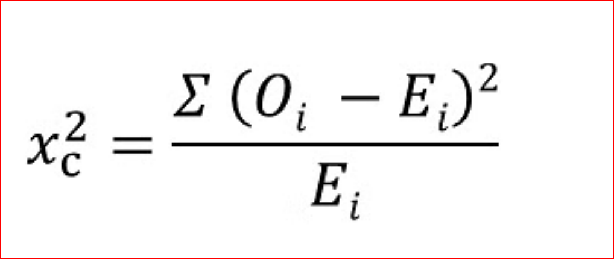

# What Is a Chi-Square Test?

The Chi-Square test is a statistical procedure for determining the difference between observed and expected data. This test can also be used to decide whether it correlates to our data's categorical variables. It helps to determine whether a difference between two categorical variables is due to chance or a relationship between them.

A chi-square test or comparable nonparametric test is required to test a hypothesis regarding the distribution of a categorical variable. Categorical variables, which indicate categories such as animals or countries, can be nominal or ordinal. They cannot have a normal distribution since they only have a few particular values.

Chi-Square Test Formula

Where

c = Degrees of freedom

O = Observed Value

E = Expected Value

