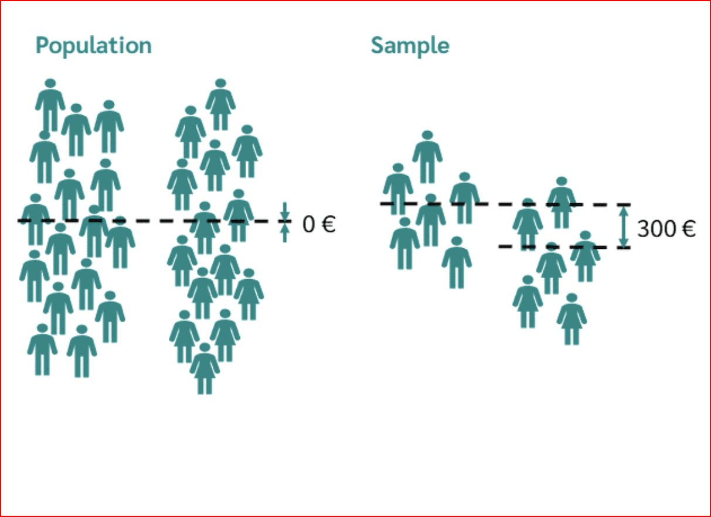

Statistical hypothesis: A claim about the value of a parameter or population characteristic.

Examples of possible hypothesis:

μ = 75 cents, where μ is the true population average of per-­student daily lunch expenses in
US high schools.

p < 0.10, where p is the population proportion of defective helmets for a given
manufacturer.

If μ1 and μ2 denote the true average breaking strengths of two different types of twine, one
hypothesis might be the assertion that μ1 – μ2 = 0, or another is the statement μ1 – μ2 > 5.

# Components of a Hypothesis Test

1. Formulate the hypothesis to be tested.

2. Determine the appropriate test statistic and calculate it using the sample data.

3. Comparison of test statistic to critical region to draw initial conclusions.

4. Calculation of p-­value.

5. Conclusion, written in terms of the original problem.

# Formulating the hypothesis to be tested

In any hypothesis-­testing problem, there are always two competing hypotheses under
consideration:

1. The null hypothesis (H0)

2. The research or alternative hypothesis (H1)

The objective of hypothesis testing is to decide, based on sample information, if the alternative
hypotheses is actually supported by the data. We usually do new research to challenge the
existing (accepted) beliefs.

This initially favored claim (H0) will not be rejected in favor of the alternative claim (Ha or H1)
unless the sample evidence provides significant support for the alternative assertion.

If the sample does not strongly contradict H0, we will continue to believe in the plausibility of
the null hypothesis.

The two possible conclusions: 

1) Reject H0.

2) Fail to reject H0.

## Why be so committed to the null hypothesis?

Sometimes we do not want to accept a particular assertion unless (or until) data can show
strong support

Reluctance (cost, time) to change

Example: A company is considering putting a new type of coating on bearings that it produces.

The true average wear life with the current coating is known to be 1000 hours. With μ denoting
the true average life for the new coating, the company would not want to make any (costly)
changes unless evidence strongly suggested that μ exceeds 1000.

An appropriate problem formulation would involve testing H0: μ = 1000 against Ha or H1: μ >
1000.

It would take conclusive evidence to justify rejecting H0 and switching to the new coating.

The alternative to the null hypothesis H0: θ = θ0 will look like one of the following three
assertions:

1. Ha: θ ≠ θ0

2. Ha: θ > θ0 (in which case the null hypothesis is θ ≤ θ0)

3. Ha: θ < θ0 (in which case the null hypothesis is θ ≥ θ0)

# Errors in Hypothesis Testing

Choice of a particular test procedure must be based on the probability the test will produce
incorrect results.

In the worst case, a sample is taken that happens to deviate very strongly from the population
and the wrong statement is made. Therefore, there is always a probability of error for every
statement or hypothesis.

• A type I error is when the null hypothesis is rejected, but it is true (false-positive).

• A type II error is not rejecting the null hypothesis when it is false (false-negative).

# Level of significance (Type I errors)

A hypothesis test can never reject the null hypothesis with absolute certainty. There is always
a certain probability of error that the null hypothesis is rejected even though it is actually true.
This probability of error is called the significance level or α.

We usually specify the largest value of α that can be tolerated, and then find a rejection region
with that α.

Traditional levels of significance are .10, .05, and .01, though the level in any particular
problem will depend on the seriousness of a type I error—

The more serious the type I error, the smaller the significance level should be.

# p-value

The p-value indicates the probability that the observed result or an even more extreme result
will occur if we hold that the null hypothesis is true.

Say the null hypothesis is that the salary                
of men and women does not differ in
Germany, then there will certainly still be
a difference in the sample, e.g. a
difference of 300 euros per month. Now
the p-value tells you how likely it is that a
difference of 300 euros or more will occur
by chance in the sample if there is no
difference in the population.

If the result is a very small probability, you
can of course ask yourself whether the
assumption about the population is true at
all.

# When is the p-value used?

The p-value is used to either reject or retain (not reject) the null hypothesis in a hypothesis
test. If the calculated p-value is smaller than the significance level, which in most cases is 5%,
then the null hypothesis is rejected, otherwise it is retained.

Example: The null hypothesis is that there is no difference between the salaries of men and
women.

Now a sample is taken with the salary of men and women. These are our observed results.

We assume that the null hypothesis is true, that is, that there is no difference between the
salaries of men and women.

In the observed result (sample) we now find out that men earn 150 € more per month than
women.

The p-value now indicates how likely it is to draw a sample in which the salary of men and
women differ by 150€ or more, even though there is no difference in the population.

If the p-value is e.g. 0.04, it is only 4% likely to draw a sample of 150€ or more extreme, if
there is no difference in salary in the population.

